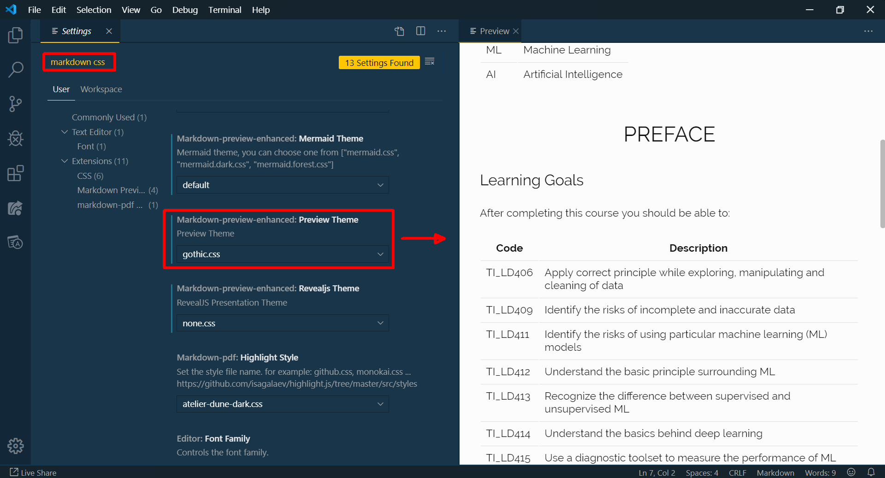

# Artificial Intelligence Principles

## 01 - Introduction

In this Artificial Intelligence principles course of the AP University College (Antwerp, Belgium), you will become acquainted with artificial intelligence in general and with supervised machine learning in particular. The goal is to bring you hands-on experience in _solving real-world prediction problems_ using the most popular regression and classification algorithms.

### Terms and Abbreviations

| Term    | Description                        |
| ------- | ---------------------------------- |
| AI      | Artificial Intelligence            |
| CSS     | Cascading Style Sheets             |
| IDE     | Integrated development Environment |
| HTML    | HyperText Markup Language          |
| ML      | Machine Learning                   |
| VS Code | Visual Studio Code IDE             |
| SVG     | Scalable Vector Graphic            |
| YAML    | YAML Ain't Markup Language         |

### Viewing this Course

This document is written in [Markdown](https://github.com/adam-p/markdown-here/wiki/Markdown-Cheatsheet) and endeavors to adhere to the [version 0.29 CommonMark specification](https://spec.commonmark.org/0.29/) with addition of a YAML header for the metadata. You are best to view this document in [VS Code](https://code.visualstudio.com/) (and _not_ in an online editor) and check out the [Markdown All in One](https://github.com/yzhang-gh/vscode-markdown) and other extensions.

Why Markdown?

There are several of reasons:

- Markdown allows for separation of content and style
- _You_ decide on the theme to view the document
  

How?

  

  

- You can also create a custom layout in plain CSS
- Markdown allows interpreters to analyse the document (this would be very messy using MS Office products)
- Markdown is independent of any software vendor
- Markdown format can immediately be converted to any other document format (e.g. using [pandoc](https://pandoc.org/))
- There is default support for HTML, SVG and [LaTeX](https://en.wikipedia.org/wiki/LaTeX) but you find support for other inclusions such as Graphviz diagrams
- &hellip;

### Learning Goals

After completing this course you should be able to:

| Code     | Description                                                                           |
| -------- | ------------------------------------------------------------------------------------- |
| TI_LD406 | Apply correct principle while exploring, manipulating and cleaning of data            |
| TI_LD409 | Identify the risks of incomplete and inaccurate data                                  |
| TI_LD411 | Identify the risks of using particular machine learning (ML) models                   |
| TI_LD412 | Understand the basic principle surrounding ML                                         |
| TI_LD413 | Recognize the difference between supervised and unsupervised ML                       |
| TI_LD414 | Understand the basics behind deep learning                                            |
| TI_LD415 | Use a diagnostic toolset to measure the performance of ML models                      |
| TI_LD416 | Recognize the principles behind training and cross-validation                         |
| TI_LD417 | Visualize complex data                                                                |
| TI_LD418 | Develop the proper artificial intelligence (AI) strategy based on a problem statement |
| TI_LD419 | Correctly and clearly report the results of a ML analysis                             |
| TI_LD519 | Independently develop a data analysis project based on raw data, a problem statement  |
| TI_LD521 | Choose the right algorithm for the problem                                            |
| TI_LD522 | Work in a team to complete an analysis project                                        |
| TI_LD523 | Communicate the result of an analysis project is a clear and concise manner           |

### Learning Content

Here is a set of tools and techniques you will encounter in this course:

- Python
- Python ML libraries such as scikit-learn
- Python data mining libraries such as pandas and numpy
- Jupyter Notebooks
- Regular expressions
- The JavaScript D3 data visualization library

### About this Course

In this course, you will learn how to work in the field of AI. Most importantly, you will learn how to develop ML algorithms hands-on. Moreover, after this course, you should be abe to understand the basic gist behind a number of the most popular algorithms. You will learn how to translate a real-life problem into a ML analysis project using the most appropriate algorithm. In addition, you will appreciate the importance of diagnosing your solution and communicating the solution in the format of notebooks. Finally, you will learn how working in a ML team may be beneficial.

The course is divided into two parts, one for theoretical considerations an one for practice. During the theory classes, the lector will demonstrate how to go from a problem statement to a solution. Every now and then, the lector will interrupt the demonstration to introduce new topics.

Course notes and intermediary challenges will be presented as Markdown files and placed on (TODO: Path) (Github)[http://LINK_HERE]. Exams will resemble in format and content these intermediary challenges.

### How to Pass this Course

First of all, there is no need for prior knowledge to pass this course. You will not be confronted with the rather complex algorithms (e.g. during optimization) that run in the background. You will learn _some_ principles behind _some_ of the more popular algorithms without the need of mathematical formulas, although you will be given references should you have the interest to dig a bit deeper. Two professionals that have proven that you can teach AI principles without the heavy-lifting mathematics are [Sebastian Thrun](https://en.wikipedia.org/wiki/Sebastian_Thrun) and [Yaser Abu-Mostafa](https://en.wikipedia.org/wiki/Yaser_Abu-Mostafa).

Secondly, the goal is the arouse your passion for AI. To scratch the surface of the endless possibilities that AI offer. Your success in completing this course will almost entirely depend on your effort and dedication you show during the classes more so than it does on your capabilities. So procrastinators: be warned.

### Principles First

The idea of teaching the _principles_ behind AI is that it will not concern itself with the wealth of technologies and platforms available. Instead, the choice was made to introduce AI using only one Python library (`sklearn`). Although this is one of the more popular frameworks, chances are that in your professional career you will be asked to perform an AI project on other platform or in another programming language.

### Acknowledgements

_John Gruber_ (born 1973) is a blogger who invented the Markdown markup language. He is most famous for his [_Daring Fireball_](https://daringfireball.net/) technology blog.
