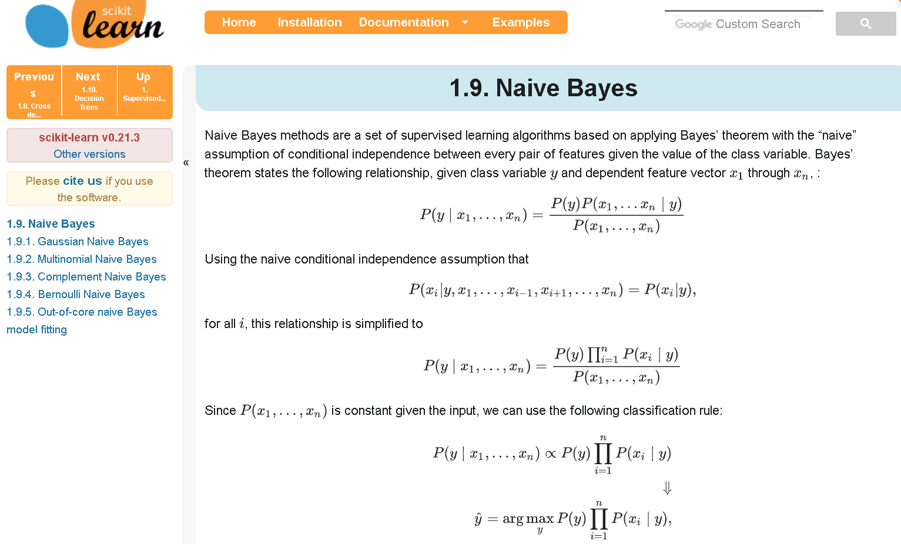

# Artificial Intelligence Principles

32318/1700/1920/1/22
D'Haese David

---

## 02 - AI Project Flow

Let us get started by running a ready-made block of code using the `sklearn` library and real training data. The task at hand is to predict wether a person is present in a room or not based on sensors measuring the room's air temperature, air humidity, light and CO<sub>2</sub> concentration. We will learn the theory along the way.

### Terms and Abbreviations

| Term          | Description                                         |
| ------------- | --------------------------------------------------- |
| AI            | Artificial Intelligence                             |
| Algorithm     | A set of instructions                               |
| CSS           | Cascading Style Sheets                              |
| CSV           | Comma-Separated Values                              |
| Data frame    | A *DS* represented as a set of linked *data series* |
| Data series   | An enriched array used to represent a variable      |
| DS            | A data set, literally a set of data elements        |
| Feature       | An input *variable*                                 |
| HTML          | HyperText Markup Language                           |
| IDE           | Integrated development Environment                  |
| Instance      | An instantiation of the *variables* in a data set   |
| JSON          | JavaScript Object Notation                          |
| Jupyter       | A notebook processor                                |
| Learner       | A ML algorithm                                      |
| Matrix        | A 2-dimensional numeric array                       |
| ML            | Machine Learning                                    |
| OS            | Operating System                                    |
| Outcome       | The output *variable* to be predicted               |
| PIP           | Python Package Installer                            |
| PPV           | Positive predictive value                           |
| Randomize     | Splitting instances into training and testing set   |
| ROC           | Receiver Operating Characteristic                   |
| Shape of *DS* | Dimensions or structure of a *DS*                   |
| SVG           | Scalable Vector Graphic                             |
| TAB           | Tabulation                                          |
| Testing set   | Set of instances used to test the *learner*         |
| TNR           | True negative rate                                  |
| TPR           | True positive rate                                  |
| Training set  | Set of instances used to train the *learner*        |
| UCI           | University College Irvine                           |
| Variable      | A measure/property represented by a *data series*   |
| VS Code       | Visual Studio Code IDE                              |
| YAML          | YAML Ain't Markup Language                          |

### Installation

If you want to be able to follow this course step-by-step, make sure to install these:

- Install [VS Code](https://code.visualstudio.com/download) IDE

  <details><summary>more …</summary>

  - You can open VS code and set a folder as a workspace with the command `code` in that folder
  - If never done so before, open the welcome screen of VS code and go through all the linked tutorials

  > TIP: Check `File > Auto Save`

  </details>

- Install [Python 3.7.3 or higher](https://www.python.org/downloads/)

  <details><summary>more …</summary>

  - Make sure to set check the 'set Path' option during installation or [set the path manually](https://www.windows-commandline.com/set-path-command-line/)
  - Open VS Code and open a console with `Ctrl + ù` (on AZERTY, or find keybinding with `Ctrl + K + S`)
  - Check the Python version using the `python --version` command. You should get `Python 3.7.3`

  </details>

- Install `Python Extension Pack` and `Python` extensions and read [these](https://code.visualstudio.com/docs/languages/python) guidelines
- Install [pip](https://pip.pypa.io/en/stable/)

  <details><summary>more …</summary>

  - Follow the instructions in the link
  - Check the pip version using `pip --version`, you should have version `20.0.2` or higher
  - If not, execute he command `python -m pip install --upgrade pip`
  - Should you get an error like `Fatal error in launcher: Unable to create process using...`, then remove old versions of Python from your system and clean up the PATH system variable. If that does work, then check [this post](https://stackoverflow.com/questions/24627525/fatal-error-in-launcher-unable-to-create-process-using-c-program-files-x86).

  </details>

- Install [Jupyter](hhttps://jupyter.org/) with the command `pip install jupyter`

  <details><summary>more …</summary>

  - Might take a while
  - Afterwards check the jupyter version with the command `jupyter --version`
  - Jupyter core should be of version `4.6.1` or higher

  </details>

### Occupancy: Your First Prediction

The goals of your first assignment is to reproduce the work published by Candanedo and Feldheim (2016)<sup>1</sup>. The authors have tried to predict the presence of a human in a room based on the reading of 4 sensors measuring light, temperature, humidity and CO<sub>2</sub> concentration. Here is the program in Python:

```python
# Import external modules
import pandas as pd
import numpy as np

import matplotlib.pyplot as plt
import plotly.graph_objects as go

from time import perf_counter
from sklearn.naive_bayes import GaussianNB
from sklearn.metrics import accuracy_score, plot_roc_curve
from sklearn.model_selection import train_test_split

# Loading the data
data_df = pd.read_csv("dat/occupancy.tab", sep="\t")

# Filtering the data
feat = data_df[["Light", "CO2"]]
outc = data_df.Occupancy

# Randomizing the data
feat_trai, feat_test, outc_trai, outc_test = train_test_split(
    feat, outc, test_size=0.33, random_state=42)

# Training the algorithm
learner = GaussianNB()
learner.fit(feat_trai, outc_trai)

# Prediction
outc_pred = learner.predict(feat_test)
outc_pred_prob = learner.predict_proba(feat_test)[:, 1]

# Plotting decision boundary of trained algorithm and overlaying test points
x_min = feat.Light.min()-100
x_max = feat.Light.max()+100
y_min = feat.CO2.min()-100
y_max = feat.CO2.max()+100
n = 100

x_ax = np.linspace(x_min, x_max, n)
y_ax = np.linspace(y_min, y_max, n)
grid=[[x, y] for y in y_ax for x in x_ax]
z = learner.predict_proba(grid)[:, 1]
z = z.reshape(n, n)

present = outc_test == 1
absent = outc_test == 0

fig_data = [
    {"type": "contour",
        "name": "Prob(Present)",
        "x": x_ax, "y": y_ax, "z": z,
        "showlegend": True,
     "colorscale": [
        [0.0, "lightsteelblue"],
        [0.5, "lightgrey"],
        [1.0, "navajowhite"]]},
    {"type": "scatter",
        "name": "Present",
        "showlegend": False,
        "mode": "markers",
        "marker": {"size": 3, "color": "orange"},
        "x": feat_test.Light.loc[present],
        "y": feat_test.CO2[present]},
    {"type": "scatter",
        "name": "Absent",
        "showlegend": False,
        "mode": "markers",
        "marker": {"size": 3, "color": "steelblue"},
        "x": feat_test.Light.loc[absent],
        "y": feat_test.CO2[absent]}]

fig_layout = {
    "title": "Decision boundary for Naïve Bayes Classifier",
    "xaxis_title": "Light (Lux)",
    "yaxis_title": "CO<sub>2</sub> Concentration (ppm)" }

fig = go.Figure (fig_data, fig_layout)
fig.show()

# Measuring the accuracy of the algorithm
performance = accuracy_score(outc_pred, outc_test)

# Plot the confusion matrix
print(confusion_matrix(outc_test, outc_pred, labels=[0, 1]))

message = "Performance of the classifier when using Light and CO2 " + \
         f"features:\n{performance:.2%}"
print(message)
# Plotting the ROC curve
fig, ax = plt.subplots()
ax.plot([0, 1], [0, 1], linestyle='--', lw=2, color='r',
        label='Chance', alpha=.8)
plot_roc_curve(learner, feat_test, outc_test, ax=ax )
ax.set_title('ROC Curve for GaussianNB')
plt.show()
```

> __NOTE__: The above script and the corresponding notebook are far from perfect and we will improve on our ability to create more professional analyses as we go along.

If you run the above Python script, you should see the following pictures appearing:


and the following output:

```txt
Performance of the classifier when using Light and CO2 features:
97.35%
```

In the next paragraphs of this first assignment, we will start tearing apart every line of the above script and it's output and discuss in great detail what the code actually does. In the meanwhile, we will be learning about some basic principles of doing a ML project using Python and Jupyter Notebooks.

### Running the Occupancy Notebook

Just this once, we will go over the challenge step-by-step. As always, there are many ways to achieve the same result but many of those ways are bad practice, so try to follow the below steps as closely as you can.

1. Free up memory

   <details><summary>more  …</summary>

   You can start by closing all unnecessary applications. When you're about to do data science on a local machine, it's good practice to keep a close eye on and free up some memory and processor time (press `Ctrl + Shift + ESC` on Windows OS). So, if needed you might need to restart your system.

   </details>

2. Clone the Git Classroom's repository

   <details><summary>more  …</summary>

   - Follow [this invitation link](https://classroom.github.com/a/AFNQ8XLQ) to the GitHub Classroom for the `AI Principles Challenges` assignment, you should see something like:

   

   - Clone your assignment-response repository

     <details><summary>more  …</summary>

      - Copy your personal link to the assignment-response repository
      - Using VS Code's explorer (`Ctrl + Shift + E`), navigate to the *parent folder* that contains the local repository of the theoretical nodes of this course
      - Then, open a `cmd`-type terminal (choose `Terminal: Select Default Shell` from VS Code's command pallette to switch the type of terminal) and clone the git repository with the command `git clone <your assignment-response repository here>`.

     </details>
   </details>

3. Open the Jupyter Notebook in your browser

   <details><summary>more  …</summary>

   > NOTE: The browser is typically *not* the place in which we will be developing and debugging Python code, is only serves to *view* or *run* the code and make adjustments to non-coding portions of the Notebook.

   In the GitHub Classroom's repository, you should see a `dat` folder as well as the files `Occupancy.ipynb` (the Jupyter Notebook) and `Occupancy.py` (the associated Python script). Here are two ways to open the Notebook file for viewing and running:

   - In your assignment response repository in GitHub, simply open the `*.ipynb` file (viewing only)
   - Using the command line of your OS locally, navigate to correct folder and execute the command `jupyter notebook` (Viewing and running)
   - Check that the `jupyter` server is running using the `jupyter notebook list` command and check other command using `jupyter -h` and `jupyter notebook -h` commands (if needed, remember you can check active connections using the `netstat` command)

   </details>

4. Prepare VS Code to run Python

   <details><summary>more  …</summary>

   With a Python or Jupyter Notebook file opened, VS Code's status bar (left hand side) indicates the currently coupled Python interpreter. If it is the wrong one or if it says that there is no interpreter coupled, then click the text or choose the command `Python: Select Interpreter` from VS Code's command palette (`Ctrl + Shift + P`) and make sure that Python 3.7.3 is selected.

   </details>

5. Open the Jupyter notebook `Occupancy.ipynb` in VS Code

   <details><summary>more  …</summary>

   In VS Code's explorer pane, right click on the file `Occupancy.ipynb` and choose the command `Open in Notebook Editor` from the popup menu (check above prerequisites if you cannot see this command in the popup menu). If you experience issues, open the file and close it again and check the Jupyter output in the `output` tab of VS Code's terminal pane. If you see something along the lines of `ModuleNotFoundError: No module named 'win32api'`, then run the command `pip install pypiwin32` in the terminal.

   </details>

6. Run the Notebook

   <details><summary>more  …</summary>

   We will learn more about the use of Notebooks later. For now, it suffices to have a look at [this article](https://code.visualstudio.com/docs/python/jupyter-support) on the use of Jupyter Notebooks in VS Code. To run the cell, click the arrow at the top of VS Code's Notebook editor that says `Run all cells`.

   </details>

7. Debug

   <details><summary>more  …</summary>

   The first time you run the cell you might get errors like this:

   ```txt
   ---------------------------------------------------------------------------
    ModuleNotFoundError                       Traceback (most recent call last)
    in
          1 # External libs
    ----> 2 from sklearn.naive_bayes import GaussianNB
          3 from sklearn.metrics import accuracy_score
          4
          5 # Own libs

    ModuleNotFoundError: No module named 'sklearn'
   ```

   A `ModuleNotFoundError` obviously points towards the lack of some resource. Simply install the missing resource using the command `pip install <module name here>` in VS Code's cmd terminal and you should be good to go.

   </details>

> __NOTE__: Jupyter Notebooks come with their own IDE. Although arguably more stylish then VS Code's Notebook editor, it lacks proper support for intellisense and debugging. So in summary: *for viewing or running a Jupyter Notebooks, you can use Jupyter's IDE*, but *for developing and debugging you should use VS Code*.

### Importing Data Science Modules

The first lines of our code are imports to allow you to perform data science using python.

```python
import pandas as pd
import numpy as np
import matplotlib.pyplot as plt
import plotly.graph_objects as go
```

If you want to understand the relationships among the packages `numpy`, `sklearn`, `pandas`,  …, just use `pipdeptree` to build a dependency tree like the one below:

```txt
jupyter==1.0.0
  - ipykernel [required: Any, installed: 5.1.3]
  - ipywidgets [required: Any, installed: 7.5.1]
  - jupyter-console [required: Any, installed: 6.1.0]
  - nbconvert [required: Any, installed: 5.6.1]
  - notebook [required: Any, installed: 6.0.3]
  - qtconsole [required: Any, installed: 4.6.0]
matplotlib==3.1.2
  - numpy [required: >=1.11, installed: 1.18.1]
pandas==0.25.3
  - numpy [required: >=1.13.3, installed: 1.18.1]
sklearn==0.0
  - scikit-learn [required: Any, installed: 0.22.1]
    - numpy [required: >=1.11.0, installed: 1.18.1]
    - scipy [required: >=0.17.0, installed: 1.4.1]
      - numpy [required: >=1.13.3, installed: 1.18.1]
plotly==4.5.0
```

Or as a graph (download [Graphviz Markdown Preview](https://marketplace.visualstudio.com/items?itemName=geeklearningio.graphviz-markdown-preview) and view in VS Code if you cannot see the graph appearing):

```viz
digraph D {
  sklearn [shape = box]
  scipy [shape = box]
  pandas [shape = box]
  numpy  [shape = box]
  matplotlib  [shape = box]
  plotly [shape = box]

  sklearn -> numpy
  sklearn -> scipy
  scipy -> numpy
  pandas -> numpy
  matplotlib -> numpy
}
```

The [`pandas` module](https://pandas.pydata.org/pandas-docs/stable/index.html) allows for manipulation of data. Typically, data is handled as so-called *data frames*, an idea borrowed from R.

> __NOTE__: In the meanwhile, R has moved on to "data tables" which are more efficient and user-friendly

A data frame can be regarded as an enriched array that allows for the columns to have different data types (in contrast to the mathematical *matrix* which typically contains only numerical values). In addition, the enrichment serves to perform operations on the data using the feature names and to keep the columns properly aligned during merging and sorting:

```python
analysis_df = pd.merge(scores_df, motivation_df, on='student_id', sort = True)
```

We will be encountering several functionalities of data frames and other pandas functions along our path.

### Importing Scikit-Learn Modules

There are several Python libraries available for running ML algorithms (`TensorFlow`, `Keras`, `PyTorch`,  …), but `sklearn` (scikit learn) seemed appropriate to learn the first steps of ML and will be the main library used in this course:

```python
from sklearn.naive_bayes import GaussianNB
from sklearn.metrics import accuracy_score, plot_roc_curve
from sklearn.model_selection import train_test_split
```

The first line imports the class `GaussianNB` a particular type of algorithm called the _Gaussian Naive Bayes_ algorithm. We will learn a bit more about the inner workings of this learner, but for now all you need to know is that this algorithm is one of many. The other imports will become clear later.

### Searching the Scikit-Learn Library

Well, if you are told to train a Gaussian Naive Bayes learner from the Scikit Learn library, you simply Google it:


The first link in the above screenshot brings you to the actual class for the Gaussian Naive Bayes, while the second one brings you to the set of classes all belonging to the Naive Bayes group. If you follow the second link, as will generally be the case on syou'll find some theoretical considerations:



Don't be put off by the mathematical equations. As promised, this course will be low on mathematics, so you can safely skip that part and scroll down to the example code for the `GaussianNB` class:


Scikit learn will always have some example code and copying from it will be the most efficient to get started on a new algorithm.

### Loading the Data

The first thing to do generally is to load the data:

```python
# Loading the data
data_df = pd.read_csv("dat/occupancy.tab", sep="\t")
```

The above line says that from the `pandas` module, which as been defined with the alias `pd` within the local namespace, we evoke the `read_csv` function to read the file `dat/occupancy.tab` into a data frame object named `data_df`.

> __IMPORTANT__: In the above Python script, comments were included. Generally, comments (apart from docstrings) are only necessary in case the reader skilled in the art and aware of the particular task might be confused, for example when the order of instruction is unexpected and due to performance reasons. Here, they have been added only in this first exercise and only in the Python script. In Jupyter Notebooks, the rule is to have **no comments at all** as all the context is provided as Markdown.
>
> __NOTE__: Although CSV is a very popular file format, I would opt for tab-delimited text format wherever possible. TAB-delimited text files are smaller and less error-prone. Since the comma more frequently occurs inside textual data, escape characters are needed to make a clear distinction between data and separator. Most errors in CSV file are due to incorrect use of escape characters. Best to avoid CSV altogether and use TAB-delimiters instead. Remember to use the `*.tab` extension in case of TAB-delimited files.

If you now run the above code in debug mode (see instructions [here](https://code.visualstudio.com/docs/python/jupyter-support)), you can see the structure of the `data_df` object in the `Variables` panel and print its content in the `Debug Console` window:


### Features, Instances and Outcome

There are many ways to shape or structure data for a ML project. For now, we choose the following shape:


So the variables (= *features* + *outcome*) are the columns and the rows are called the *instances*. Features are the variables that are included as evidence whereas the outcome represent the variable that, in a given context, one wants to predict. There exist several other names for these dimensions. Instances also go by the name of *examples*, *cases*, *observations* and *records* and variables are also called attributes and fields. Whenever the outcome are being distinguished from the other variables they sometimes go by the name of *labels*.

An other way to represent the relation between features and the outcome is like so:


, where $model$ stands for the function that can predict the outcome starting from the features.

> __PRINCIPLE: In supervised ML, we are given a feature set and the outcome and the main question to be answered is: "Can we find a model that can predict the outcome given the feature set?"__

### Inspecting and Understanding the Data

This may be the most important and most frequently neglected step in data analysis projects. So take the time (at least 5 minutes) to look at the data and try to understand if it makes sense.

> __TIP__: During the examination, keeping time is crucial. However, not taking your time understanding the data first will probably cost you much more time in the end.

To start with, remember that there is this little JSON file containing meta data to explain the features and provide some extra overall information:

```json
{
  "title": "Occupancy Detection Data Set",
  "description": "Experimental data used for binary classification (room occupancy) from Temperature, Humidity, Light and CO2. Ground-truth occupancy was obtained from time stamped pictures that were taken every minute.",
  "data_set_type": ["Multivariate", "Time-Series"],
  "instances_count": 20560,
  "publication_date": "2016-02-29",
  "origin_contact_email": "Luis Candanedo <luismiguel.candanedoibarra@umons.ac.be>",
  "outcome": "Occupancy",
  "outcome_type": "Binary",
  "feature_type": "Real",
  "feature_count": 7,
  "variable_descriptions": {
    "Time": "Time of measurement",
    "Temperature": "Temperature in Celsius",
    "Humidity": "Relative air humidity in %",
    "Light": "Light intensity in Lux",
    "CO2": "CO2 concentration in ppm",
    "Humidity_Ratio": "Derived quantity from temperature and relative humidity, in kg[water-vapor]/kg[air]",
    "Occupancy": "0 or 1, 0 for not occupied, 1 for occupied status"
  },
  "references": [
    "Candanedo, L. M., & Feldheim, V. (2016). Accurate occupancy detection of an office room from light, temperature, humidity and CO2 measurements using statistical learning models. Energy and Buildings, 112, 28-39."
  ]
}
```

So we see that the meta data (which is adapted from the [UCI repository](https://archive.ics.uci.edu/ml/datasets/Occupancy+Detection+)) confirms that there are 20 560 instances. In addition, we see that the publication date of the data in the UCI repository makes sense regarding the times given in the data set (`2015-02-02 14:19`,  …) and the publication date of the scientific paper<sup>1</sup>. Next, we acknowledge that the outcome (the `Occupancy` variable) is binary, while the features are *real-valued* (with one special case holding time information). Finally, we discover the units in which the data need to be read.

> __TIP__: For future data sets, be prepared to answer the question: "Do you see anything out of the ordinary in this data?".

### Splitting the Data into Features and Outcome

We will carry on splitting the features from the outcome and for now will be focusing on the Light and CO<sub>2</sub> measurements:

```python
# Filtering the data
feat = data_df[["Light", "CO2"]]
outc = data_df.Occupancy
```

Graphically, we will be representing this operation in a simple diagram:


We will be building further upon this simple diagram whe introduce other steps in the ML life cycle and when introducing other types of ML.

### Describing Features

As mentioned, we will be looking at the light and CO<sub>2</sub> measurements. Let us start with a pandas command to describe the light intensity measurements:

```python
> print ( data_df.Light.describe())

count    20560.000000
mean       130.756621
std        210.430875
min          0.000000
25%          0.000000
50%          0.000000
75%        301.000000
max       1697.250000
Name: Light, dtype: float64
```

, we already notice that the maximum value is suspiciously high (more lit then a typical TV studio lighting according to Wikipedia<sup>2</sup>).

We will learn much more about exploring data later, for now we accept the data as is.

### Randomization

A key step in ML analyses is the splitting of the set of instances into a set of *training instances* and a set of *test instances*:


This step is called here *randomization*, a term borrowed from the field clinical statistics where patients are being placed inside one or the other group (e.g. the placebo group). Here is the code that does the randomization for our occupancy data set:

```python
# Randomizing the data
feat_trai, feat_test, outc_trai, outc_test = train_test_split(
    feat, outc, test_size=0.33, random_state=42)
```

The `sklearn` framework makes randomization really easy. In this case, the goal is to divide the set of instances of our data set into two parts, one being twice as large as the other. Notice that we provide the `train_test_split` with the features and the outcomes separately and that the function splits both along the instance axis, resulting in 4 data sets. In R, features are generally not separated from the outcomes and this is a bit safer.

Let us try to understand a bit more about this function by calling the help of VS Code. Hover over the function in VS Code to see the [docstring](https://www.python.org/dev/peps/pep-0257/) and use `ctrl+left mouse click` on the function to view its source:


```python
def train_test_split(*arrays, **options):
    """Split arrays or matrices into random train and test subsets

    Quick utility that wraps input validation and
    ``next(ShuffleSplit().split(X, y))`` and application to input data
    into a single call for splitting (and optionally subsampling) data in a
    oneliner.

    Read more in the :ref:`User Guide <cross_validation>`.

    Parameters
    ----------
    [...]
    """
    n_arrays = len(arrays)
    if n_arrays == 0:
        raise ValueError("At least one array required as input")
    test_size = options.pop('test_size', None)
    train_size = options.pop('train_size', None)
    random_state = options.pop('random_state', None)
    [...]
```

### Training the Learner

The next step is to provide the learner with the _training set_, i.e. the set of instances to train the learner with:

```python
learner = GaussianNB()
learner.fit(feat_trai, outc_trai)
```

The first line instantiates the specific learner class and the second line performs the training. Notice that we provided only those instances that were reserved for training, *not* those reserved for testing, hence the `_trai` suffix. Notice also that the feature and outcomes are provided separately and that was the reason we splitted `data_df` along the variables axis in the first place. In R, as mentioned, the data would not be splitted upfront and a similar task would be coded as `model <- naiveBayes ( Occupancy ~ Light + CO2, data=data_df)`, so with no need for filtering.


So, in short, what happens during the learning phase of the supervised ML life cycle? The learner will endeavour to discover patterns in `feat_trai` that somehow enable the prediction of `outc_trai`. Note that the term _fit_ can be confusing as it refers to classical modelling and not ML. The result of training a learner, however, is still a _model_ similar to the regression line in simple regression analysis. This model can be copied around and investigated separately, although in our sklearn example, it resides within the `learner` variable until we actively extract its components:

```python
> learner.class_prior_
array([0.76885662, 0.23114338])

> learner.sigma_
learner.sigma_
array([[  6581.56073544,  63535.20011696],
       [  8589.90194705, 101521.9059764 ]])

> learner.theta_
learner.theta_
array([[ 24.75769559, 605.31630356],
       [481.53360741, 974.32442305]])
```

Do not worry about the meaning of these numbers just yet, we will come back to this later. For now just accept that these numbers define the model.

As you might imagine, the step of training the learner, is the most crucial step in the entire process of developing a supervised learning algorithm. This is the step where the actual pattern recognition takes place. As a AI engineer, you will spend quit some time on this part of the process.

### The Model as the Ultimate Compressor

You could regard the model as a simplified version of reality. What we have actually done while training the learner, is to compress data into a model. So the model is also a compressor, albeit not a lossless one. If we estimate the information content of the data by lossless ultra-zipping a text file containing only the variables `Light`, `CO2` and `Occupancy` we get $\approxeq$ 44 kb. In contrast, the model takes up $\approxeq$ 150 bytes making the compression factor $\approxeq$ __290__! These calculations are not very accurate (it would bring us too far to approach this question using information theory) and probably even an underestimation of the true compression factor. Also, we have to admit that the model is not a _complete_ representation of the data. In later paragraphs, we will try to estimate how accurate the model is to represent reality.

### Prediction

We focus now on the prediction of outcomes based on a set of new data called the _test set_ (of features). The first of following lines of code:

```python
outc_pred = learner.predict(feat_test)
outc_pred_prob = learner.predict_proba(feat_test)[:, 1]
```

performs the _deterministic prediction_ of whether there is a human present (1) or absent (0). The second line performs the probabilistic prediction (see below). If we examine the variable `outc_pred` we see that the learner has generated a list of predictions:

```python
> print (outc_pred)

[1 0 0 ... 0 0 0]
```

Let us visualize the process flow for prediction in a supervised learning context:


So the algorithm of the learner is being executed on the set of features that were set aside for testing.

While the prediction step is a very simple one and while it is not unique to the field of AI, it is the one the generates the most awe. If the training was done properly and if the data contains some patterns to begin with, the prediction step allows the data scientist to literally _see into the future_. A feat that mankind has pursued for thousands of years …


Only, the question is: "How accurate is the prediction?". In the case of the oracles of Delphi (portrayed above), it's difficult to say, but in ML you may never accept this ignorance. This brings us to the next paragraph.

### Plotting Results

There are several points during the supervised ML life cycle where it is crucial to make visualizations. The first one, which we have skipped here, is during the exploration phase. The other points during the life cycle are after prediction and during diagnosis (_see below_). What we will be doing here is plotting the decision boundary. This is already quite advanced, but it will be worth the trouble. Let us break-down the code for plotting the decision boundary into manageable chunks:

```python
x_min = feat.Light.min()-100
x_max = feat.Light.max()+100
y_min = feat.CO2.min()-100
y_max = feat.CO2.max()+100
n = 100
```

This first bit of code defines the ranges for creating an XY-grid (=2-dimensional grid), where x (the horizontal axis) represents the feature `Light` and y (vertical axis) represents the feature `CO2`:


But why would we create a grid like that? Well, the goal is to show the result of the prediction __for all possible combinations of the features Light and CO<sub>2</sub>__. As we will see later, a great amount of information can but extracted from the decision boundary of an algorithm. The actual creation of the grid starts with building the axes for the x and the y dimension. This is being done using `numpy`'s `linspace` function:

```python
x_ax = np.linspace(x_min, x_max, n)
y_ax = np.linspace(y_min, y_max, n)
grid=[[x, y] for y in y_ax for x in x_ax]
```

Now that we have built our grid, we can predict the presence of a human in the room for each combination of the `x_ax` and `y_ax` values:

```python
z = learner.predict_proba(grid)[:, 1]
z = z.reshape(n, n)

present = outc_test == 1
absent = outc_test == 0
```

Here the __probabilistic prediction__ is being performed. In this case, the learner will not just provide the prediction of _whether_ there is a human present but will predict _the probability_ of a human being present. And because in our example, the Occupancy has two _classes_ or two _categories_ (0 and 1, true or false), the probability for *both* the classes is being provided. Since we only need one (namely, the probability of being present), we slice the result of the prediction using the syntax `[:, 1]`. Finally, we need to _reshape_ (oftentimes called _recast_) the 1-dimensional list of predictions to fit the matrix structure of our grid.

> __WARNING__: Pandas requires a lot of reshaping and this entails a number of risks. Firstly, it is error prone. For example, it is easy to miss the `[[` when viewing objects. Secondly, it means that coupled objects are kept in separate variables (such as `x_ax` and `y_ax`). You have to remind yourself to treat the coupled objects **exactly** the same. Suppose: you would re-order one but not the other or square one but forget to square the other. Such a mistake is easy to make and hard to debug. So be warned!

The next part is a bit larger and is the preparation for plotting the decision boundary using the `plotly` module. This module is not Python specific and allow for different approaches to create a plot. The approach adopted here is not the easiest but is the most versatile and feels more natural among programmers:

```python
fig_data = [
    {"type": "contour",
        "name": "Prob(Present)",
        "x": x_ax, "y": y_ax, "z": z,
        "showlegend": True,
     "colorscale": [
        [0.0, "lightsteelblue"],
        [0.5, "lightgrey"],
        [1.0, "navajowhite"]]},
    {"type": "scatter",
        "name": "Present",
        "showlegend": False,
        "mode": "markers",
        "marker": {"size": 3, "color": "orange"},
        "x": feat_test.Light.loc[present],
        "y": feat_test.CO2[present]},
    {"type": "scatter",
        "name": "Absent",
        "showlegend": False,
        "mode": "markers",
        "marker": {"size": 3, "color": "steelblue"},
        "x": feat_test.Light.loc[absent],
        "y": feat_test.CO2[absent]}]
```

We see that the `fig_data` object holds all the information to draw 3 layers of the plot. The first layer is a contour plot, which is ideal to color areas on a 2-dimensional grid according to a scale. The x- and y-axes are the Light and CO2, while the Z-axis represents the probability of being a human. As we have chosen here for a 'soft' boundary (=result of probabilistic approach), it is best to have a colorscale defined. The two top layers are scatter plots that show the data of the test instances with their true status (present or not) as indicated by matching colors.

```python
fig_layout = {
    "title": "Decision boundary for Naïve Bayes Classifier",
    "xaxis_title": "Light (Lux)",
    "yaxis_title": "CO<sub>2</sub> Concentration (ppm)" }
```

Finally, we decorate the plot with some main title and axes titles. Mind that *every* plot should always have a descriptive title and axis labels. Note that this way, the layout and the data of the figure are kept separate:

```python
fig = go.Figure (fig_data, fig_layout)
fig.show()
```


We can now see that there are a few orange dots over light-blue background (cases where there was a human but the learner predict there wasn't = so-called __false negatives__) and several blue dots over an peachy background (test instance where the learner erroneously predicted presence = false positives).

### Performance of the Learner

Developing an AI application without doing a proper diagnosis is silly. Why? Because in real life you generally cannot predict the future. You can _try_ to predict the future and you can get very good at it, but remember:

> __PRINCIPLE: One cannot predict events with 100% certainty__.

Let us revisit the code for doing diagnostics from our example. The first step is to measure the accuracy of the deterministic prediction:

```python
from sklearn.metrics import accuracy_score
[...]
performance = accuracy_score(outc_pred, outc_test)
message = "Performance of the classifier when using Light and CO2 " + \
         f"features:\n{performance:.2%}"
print(message)
```

which should evaluate to 97.35% in our case. This means that, assuming we did not introduce any bias, the application will correctly estimate the presence of a human in _about 97 out of the 100 cases_. This result is very good, indeed and most of the time one would settle for 75-90% accuracy.

Notice that for the first time in the process, we include the test outcomes `outc_test` into the calculations. It is a crucial principle that:

> __PRINCIPLE: In order to test the performance of an algorithm, the test outcomes should remain hidden for the learner until after the training phase.__

So, we can present the 'final' version of our life cycle for this particular case of a Gaussian Naïve Bayes classifier:


Let us try to lift the lid a little on this accuracy measure. How is it calculated exactly? For this, we can investigate what is known as the confusion matrix:

```python
print(confusion_matrix(outc_test, outc_pred, labels=[0, 1]))
```

Executing this line for the Occupancy case, you should get something like this:

```python
[[5043  176]
 [   4 1562]]
```

, where the numbers correspond to these statistics:

```python
[[TN  FP]
 [FN  TP]]
```

and where:

- _TN_ are the times when the learner correctly predicted there was no one in the room
- _TP_ are the times when the learner correctly predicted there was someone in the room
- _FN_ are the times when the learner predicted there was no one in the room while in reality there was someone
- _FP_ are the times when the learner predicted there was someone in the room while in reality there was no one

The accuracy is calculated as the percent of time that the learner predicted correctly (using the test instances). This means that we can also calculate the accuracy as:

$accuracy=\frac{TN+TP}{TN+TP+FN+FP}$

However, there are many more very useful measures that we can extract out of this simple 2x2 table. One is the _sensitivity_, sometimes also called the _recall_ or TPR (true positive rate):

$sensitivity=\frac{TP}{TP+FN}$

,which is a measure of _sensitive_ the learner is to pick up those instance that turn out to be truly positive. Next, there is the _specificity_ (or TNR: true negative rate):

$specificity=\frac{TN}{TN+FP}$

which does the same for the truly negative. Finally, there is the _precision_ (or PPV: positive predictive value):

$precision=\frac{TP}{TP+FP}$

,which measures how many of the predicted positive are truly positive. These measures can all be very useful uses depending on the context. Let us visualize these four measures on the confusion matrix (orange is numerator, blue is denominator):


Why would we introduce these other measures anyway? Why not keep it simple and stick to the accuracy? Well the reason is simple: You can have a very unreliable algorithm with a perfect accuracy. So accuracy alone _is not sufficient_ as a measure of performance. Let us consider the following confusion matrix and convince yourself that although the accuracy is fine (99.9%) the algorithm is useless:


Indeed, the specificity here is only 62.5% and in addition this number has a large error margin (not shown here) because of the small number of TN and FN. This would render the learner completely useless and it would be consider fraud to try to put a learner like this into production.

> __PRINCIPLE: Accuracy alone is generally not sufficient as diagnostic. The best is to consider confusion matrix in its totality. Measures like sensitivity, specificity and precision should be used to check and communicate whether the initial target criteria have been met.__

For more on this, see [here](https://en.wikipedia.org/wiki/Sensitivity_and_specificity).

### The ROC Curve

Let us take the diagnosis one step further. The diagnostics from previous paragraph are valid for binary classification where there is a deterministic prediction, i.e. where you have two classes in the outcome variable (true|false, 0|1, …). In the case of a Gaussian Naive Bayes learner, however, we have seen that we can predict the outcome using a probability from 0 to 1. What the learner does in the background during prediction is as follows. For a given instance, the learner calculates the probability for a human to be present in the room, call it $P[present]$. It then simply converts the probability to a deterministic call like so:

If $P[present]$ > 50%
then call it 1,
else call it 0.

But what if we were to change this threshold of 50% to something else? In other words, what if we would take over the job of the learner to call a class based on the probability. That is what ROC Curves are all about.

> __IMPORTANT__: ROC Curves are useful only when the outcome is a binary variable and when instead of only calling the class, the learner is able to calculate the probability of belonging to a class.

So let us examine the code from the Occupancy notebook:

```python
fig, ax = plt.subplots()
ax.plot([0, 1], [0, 1], linestyle='--', lw=2, color='r',
        label='Chance', alpha=.8)
plot_roc_curve(learner, feat_test, outc_test, ax=ax )
ax.set_title('ROC Curve for GaussianNB')
plt.show()
```

Notice that the figure here is being generated using a second plotting popular framework called `matplotlib`. The first line of code creates a figure (like a 'canvas') as well as an axis (more like a 'layer'). The second line plot a diagonal line. The third line adds the so called ROC curve and finally a title is added to the plot and the plot is shown:


We see that the sensitivity and specificity have been plotted against each other for a threshold changing from 0% to 100% (unlike the previous case where it was fixed to 50%). The goal is to find the best possible threshold for the job:


Do not worry if you do not grasp everything just yet, this is already a quite advanced topic.

### References

1. Candanedo, L. M., & Feldheim, V. (2016). Accurate occupancy detection of an office room from light, temperature, humidity and CO2 measurements using statistical learning models. Energy and Buildings, 112, 28-39.
2. Wikipedia contributors. (2019, December 20). Lux. In Wikipedia, The Free Encyclopedia. Retrieved 17:21, January 26, 2020, from [https://en.wikipedia.org/w/index.php?title=Lux&oldid=931674311](https://en.wikipedia.org/w/index.php?title=Lux&oldid=931674311).
3. Wikipedia contributors. (2020, January 23). Indoor air quality. In Wikipedia, The Free Encyclopedia. Retrieved 17:25, January 26, 2020, from [https://en.wikipedia.org/w/index.php?title=Indoor_air_quality&oldid=937158993](https://en.wikipedia.org/w/index.php?title=Indoor_air_quality&oldid=937158993).

### Acknowledgements


_Guido Van Rossum_ is the father of Python. He developed the language in 1989 as a Dutch IT-specialist associated with the Mathematisch Centrum in Amsterdam, Netherlands. Originally meant as a low-threshold language for beginning programmers, it now trumps all other…


Reverend _Thomas Bayes_ solved the problem of Inverse Probability which was presented at the Royal Society in 1763 after his dead by his friend Richard Price. Largely thanks to him, we now have a complete field of statistics based on probability: Bayesian statistics.
