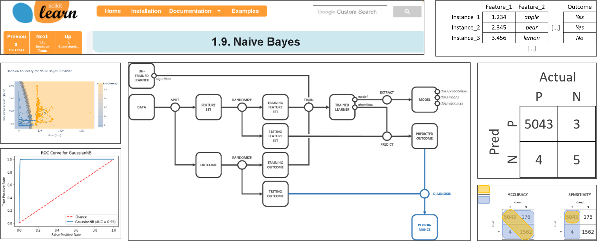
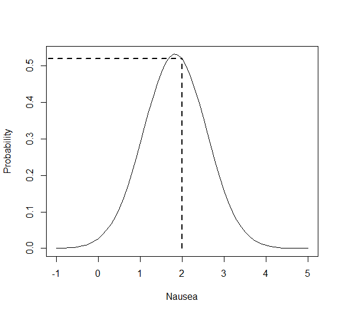
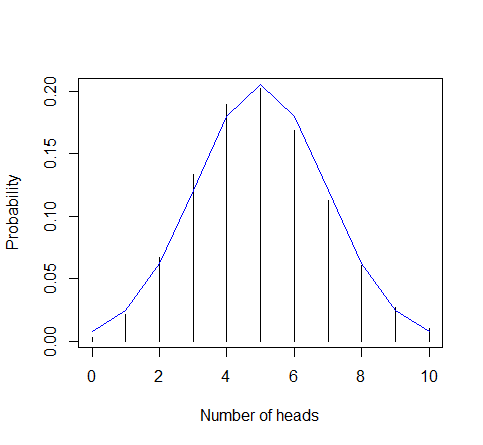
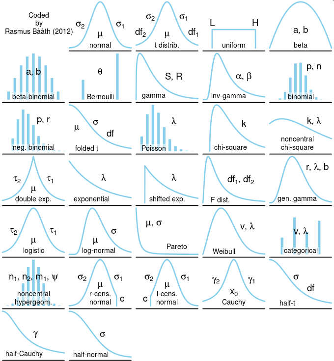
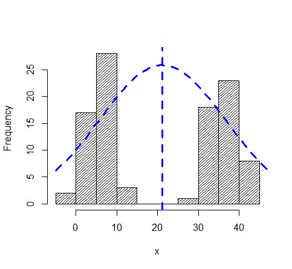
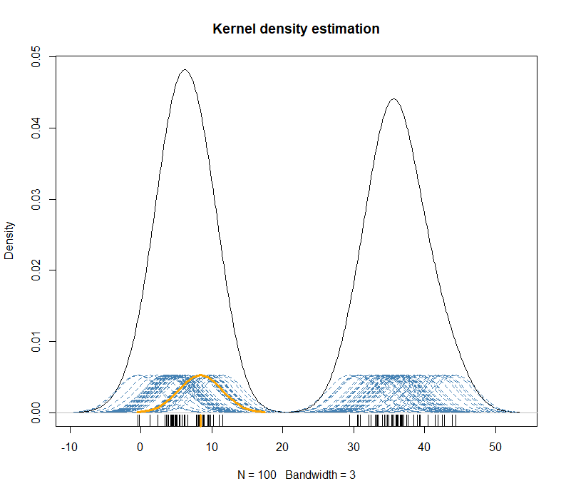
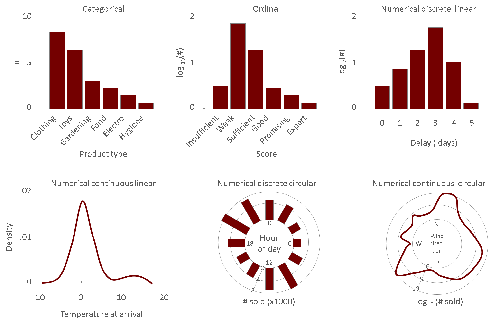

# Artificial Intelligence Principles

32318/1700/1920/1/22
D'Haese David

---

## Notes on Naive Bayes Classifier and Distributions

During this second lesson, we will first take a bird's eye perspective and asked ourselves fundamental questions such as _"What is artificial intelligence?"_. Then, we will explore some theory behind the Gaussian Naïve Bayes classifier and understand what distributions are.

### Previously on AI Principles



### Terms and Abbreviations

| Term         | Description                                       |
| ------------ | ------------------------------------------------- |
| AI           | Artificial Intelligence                           |
| Algorithm    | A set of instructions                             |
| Feature      | An input *variable*                               |
| i.e.         | Id est, reads as "which is is the same as"        |
| Instance     | An instantiation of the *variables* in a data set |
| Learner      | A ML algorithm                                    |
| ML           | Machine Learning                                  |
| Outcome      | The output *variable* to be predicted             |
| sd           | Standard deviation                                |
| Testing set  | Set of instances used to test the *learner*       |
| Training set | Set of instances used to train the *learner*      |
| Variable     | A measure/property represented by a *data series* |

### What Is Artificial Intelligence

Artificial intelligence (AI) according to the [Performance Architects](https://performancearchitects.com/) is like sex. Everyone is talking about it, nobody has any idea what they are doing, and we all think that everyone is doing it – so we all say we are doing it! AI is being hyped to the degrees that it is seen as the driver behind what [Klaus Schwab](https://en.wikipedia.org/wiki/Klaus_Schwab) coined the *Fourth Industrial Revolution* (see [here](https://en.wikipedia.org/wiki/Technological_revolution)). So, it is a big thing, but what is it exactly. Well, there is no universal agreement on the definitions, but in this course we will adopt the following definitions:

**Machine learning (ML)** — the ability of a computer systems to learn from past data and make reliable predictions for the future

_Example usage_:
*"I used ML to predict whether I would win the game tonight"*

**Artificial intelligence (AI)** — the ability of a computer systems to perform *Machine learning* and act upon it, usually by mimicking the human decision-making process

_Example usage_:
*"I still find the coolest application of artificial intelligence the self-driving car"*
*"The Netflix recommendation system is powered by artificial intelligence"*

**Algorithm** — the core part of the ML process that does the actual learning

_Example usage_:
*"I changed the algorithm in my application. It now runs on a neural network and performs better"*
*"The next version of the algorithm will have slightly different gamma values to adjust the smoothing of the predictions."*

**Big data** — either large or complex datasets or the analysis of such datasets with the aim to gain insights

_Example usage_:
*"This big data project has access to 2 zettabytes of weather data"*

**Data science** — the discipline involved in turning data into insights (> **Data mining**) possibly by way of machine learning

_Example usage_:
*"A good data scientist knows about programming and statistics, but needs to master the particular domain knowledge as well"*
*"As the data scientist was mining the data he discovered this trend, unknown to mankind"*

**Predictive analytics** — Same as ML.

We will encounter many other definitions later in this course such as **Neural network (NN)**, **Deep Learning**, **Natural Language Processing (NLP)**, etc&hellip;

### Applications of Artificial Intelligence

Watch [this video](https://youtu.be/m9D-v6r3NJQ) to get a high-level perspective of the possible applications of AI today and the near future.

Every movement we make could be recorded and stored forever. This data could be the subject of numerous big data analyses that lead to actionable insights.


<small>[Source](https://youtu.be/m9D-v6r3NJQ)</small>

But a lot of the data is not yet being captured, even in places where you wouldn't expect it. For example, in hospitals' intensive care units, only the last few years they are realizing how beneficial it could be to store and analyze the data.


<small>[Source](https://youtu.be/m9D-v6r3NJQ)</small>

### The Naive Bayes Classifier

Let us dig a bit deeper into the Naive Bayes classifier we used previously. Yes, it nice to get things working, but also good to know what we have actually done. And, so as to get into the mood for our next data set, let us consider a clinical example to explain the Naive Bayes classifier.

### Naive Bayes Example

Suppose we have the following hypothetical data:

| Health  | Temperature (C°) | Nausea (0_3) | Breath_Test (0-10) |
| ------- | ---------------- | ------------ | ------------------ |
| Healthy | 36.26            | 2            | 1                  |
| Healthy | 36.80            | 2            | 5                  |
| Healthy | 37.19            | 3            | 8                  |
| Healthy | 37.78            | 1            | 2                  |
| Healthy | 37.23            | 1            | 5                  |
| Healthy | 34.98            | 2            | 7                  |
| Ill     | 37.68            | 2            | 2                  |
| Ill     | 38.08            | 2            | 4                  |
| Ill     | 37.3             | 3            | 7                  |

The goal is to calculate the probability of being ill given easy-to-measure readings for temperature, nausea and breathing capacity. So the outcome is `Health` and the other variables are the features.

$$Health =f(Temperature, Nausea, Breath\_Test)$$

Under the Gaussian distribution assumption, we can now calculate the __mean ± standard deviation__ for the three features grouped by the outcome class:

| Health  | Temperature (C°) | Nausea (0_3) | Breath_Test (0-10) |
| ------- | ---------------- | ------------ | ------------------ |
| Healthy | 36.71 ± 0.98     | 1.83 ± 0.75  | 4.67 ± 2.73        |
| Ill     | 37.69 ± 0.39     | 2.33 ± 0.58  | 2.67 ± 1.15        |

Given the data represents all we know, then we can easily calculate the __prior probability__ of belonging to either Health class:

$$Probability(Healthy) = \frac{6}{9}$$

$$Probability(Ill) = \frac{3}{9}$$

And that is our model, really. So we wait for a test patient to arrive and perform the necessary measurements:

| Temperature (C°) | Nausea (0_3) | Breath_Test (0-10) |
| ---------------- | ------------ | ------------------ |
| 37.00            | 2            | 3                  |

We call this the __evidence__. The goal is to calculate the __posterior probability__ given the new evidence and this action is called an __update__:

> The probability of an event (being either healthy or ill) after evidence is being provided (i.e. the posterior probability) is proportional to the probability before the evidence was presented (i.e. prior probability) multiplied with the likelihood of the evidence given the (Gaussian) distributions of the features.

<details><summary>Formula</summary>

$$Posterior \propto Prior\cdot Likelihood (Evidence)$$

</details></br>

So before the new evidence (when the new patient is first presented) the prior gives our best guess for the health of this patient ($\frac{1}{3}$ chance of being ill), but what is it after the new evidence (measurements of temperature, nausea and breathing) is being presented? Here is how to do it:

1. Calculate likelihood of {temperature, Nausea, Breath_Test} being {37°C, 2, 3} given that the health status is {healthy, ill}
2. For each health status: multiply the likelihoods with each other and with the prior for that health status

<details><summary>Formula</summary>

$$Posterior(Health=Healthy|Evidence) \propto P(Healthy) \times p(Temperature=37.00|Health=Healthy) \newline \times p(Nausea=2|Health=Healthy) \times p(Breath\_Test=3|Health=Healthy)$$

$$Posterior(Health=Ill|Evidence) \propto P(Ill) \times p(Temperature=37.00|Health=Ill) \newline \times p(Nausea=2|Health=Ill) \times p(Breath\_Test=3|Health=Ill)$$

, where $P(A|B)$ means the probability of event A occurs given that B occurred.

</details></br>

We can now compute the terms by considering the distributions (assumed to be Gaussian in this case) of the prior. For example, the likelihood for have a nausea score of 2 given the patient is healthy and assuming Gaussian distribution for this score can be resolved by picking the probability from the distribution like so:



<details><summary>How to do draw this plot in R</summary>

```r
x <- seq (-1, 5, .1)
y <- dnorm(x, mean=1.83, sd=.75)
p=dnorm(2, mean=1.83, sd=.75)
plot(x, y, type="l", xlab= "Nausea", ylab="Probability")
segments(2, 0, 2, p, lwd=2, lty=2)
segments(-1.2, p, 2, p, lwd=2, lty=2)
```

</details></br>

So, for nausea and the healthy state we estimate the likelihood to be a bit more the 50%. One can actually calculate the exact probability by using the equation for a normal distribution.

<details><summary>Formula</summary>

$$p(Nausea=2|Health=Healthy) = \frac{1}{\sqrt{2 \pi \cdot 0.75^2}}e^{- \frac{1}{2} \cdot \left(\frac{2-1.83}{0.75}\right)^2}=51.84\%$$

</details></br>

After doing all the calculations you arrive at:

$$Posterior(Health=Healthy|Evidence) \propto \frac{6}{9} \times 0.3896 \times 0.5184 \times 0.1212 \propto 0.0163$$

$$Posterior(Health=Ill|Evidence) \propto \frac{3}{9} \times 0.2139 \times 0.5850 \times 0.3329 \propto 0.0139$$

After normalizing both probabilities so as to have a posterior that sums to 1, we get:

$$P(Health=Healthy|Evidence) = 54.03\%$$

$$P(Health=Ill|Evidence) = 45.97\%$$

Where this posterior can now become the prior for the next update. So, given the evidence, the patient is almost as likely to be ill than to be healthy. If you really must pick, you could say that, without any criteria provided, the patient is a bit more likely to be healthy and to be ill.

### Theoretical Distributions

In previous paragraph, we have been discussing about distributions, so maybe it's time to explore this term a bit more. First off, there are two types of distributions: __theoretical distributions__ and __data distributions__. A theoretical distribution represents a model that is human-made and may or may not exist in nature. Some of them such as the _Poisson distribution_ or the _Gaussian distribution_ (also called the normal distribution) are well known and are very important for the field of statistics. Few people realize that in fact the normal distribution is an approximation of an even more important theoretical distribution: the _binomial distribution_.

<details><summary>More on this…</summary>

Suppose you participate to an exam with 20 multiple choice questions, each with four possible answers (and only one correct), then you know that by chance alone you would hit a score of 5/20, on average. But you can also calculate the probability of correctly answering exact $x$ questions by chance only:

```r
x <- 0:10
n <- 20
p <- .25
y_bin <- dbinom(x,n,p)
y_nrm <- dnorm(x,n*p,sqrt(n*p*(1-p)))

plot(x, y_bin, type="h", ylab="Probability", xlab="Number of heads")
lines(x, y_nrm, col="blue")
```



In the above graph, the lines represent the discrete binomial distribution and the blue line is the normal distribution with $mean=np$ and $variance=npq$, where $q=1-p$ (see [Wikipedia article](https://en.wikipedia.org/wiki/Binomial_distribution) for more on this). Notice that with small values for $n$ one can indeed see that the normal approximation is merely an approximation since the blue line does not touch the tips of the blacks lines everywhere.

</details></br>

All these theoretical distributions have in common that they can be represented with a formula that is determined by a handful of parameters:



[ref](https://github.com/rasmusab/distribution_diagrams)

### Data-Distributions

Using the theoretical distributions, one can device all kinds of statistics (mean, variance, student T, …) and that is exactly what a large part of the field of statistics is concerned with. Each time you take the mean of a set of numbers you assume that these numbers have some sort of distribution, generally the Gaussian distribution, which by the way is just an approximation as we have seen above. This is fine as long as we have a good feeling about the assumption we are making. For example consider this mean ± sd of a variable $x$: 21 ± 15 (it is actually inappropriate to have a mean or other measure of central tendency without a measure of spread). Nothing wrong, you might think, until you look at the histogram of $x$:



Clearly, the normal distribution is not representative of the data and hence, the mean and sd are not appropriate!

> PRINCIPLE: It is inappropriate to have a mean or other measure of central tendency without an associated measure of spread
>
> PRINCIPLE: Every statistic is assumption-ridden

So as a data scientist, you need to be aware of the actual distribution of your data. You can do this using the histogram as seen above. Especially when the data is of a discrete type such as count data and the number of data points is limited (up to a few hundred), this is an acceptable approach. However, there are a lot of issues with histograms. There is no reason to choose one or the other bin-width (width of bars) and location of the bins on the x-axis. With larger data sets and with more continuous data types (weights, lengths, light-intensity, …) there is a better alternative: __kernel density estimation__. In this case, you draw a little kernel (dashed steelblue line with one highlighted in orange) around each data point and sum them:



(the kernels in the above figure have been stretched along the y-axis for clarity) Here is an overview of when to use bar charts, histograms and density diagrams:


