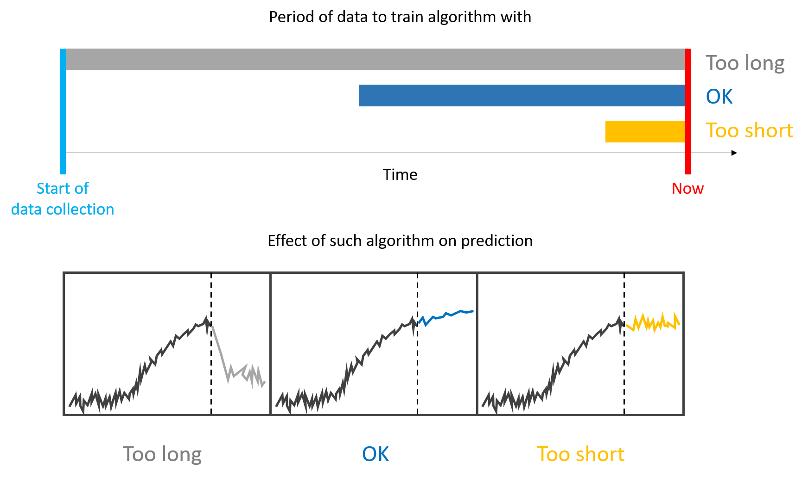
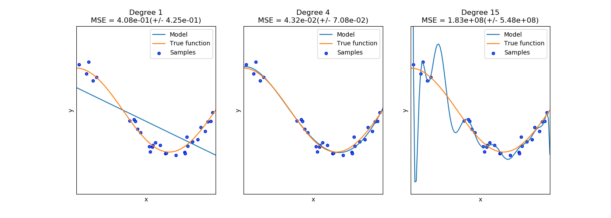

# Artificial Intelligence Principles

32318/1700/1920/1/22
D'Haese David

---


## AI Project Flow Part I & Notes on Regression and Cross-Validation

We will now again zoom out and then zoom back in again. First we will visit the typical flow of an AI project to then focus deeper on a regression analysis.

### Previously on AI Principles


### Terms and Abbreviations

### AI Project Flow

We already illustrated the workflow during a supervised ML task. Let us now zoom out and consider a generic flow for an AI project. Here are the necessary steps to be taken during such AI project in a real-life scenario (ordering is approximate):

1. Assemble a team
2. Analyse the problem statement
3. If applicable, separate entities into features and outcomes
4. Decide on the performance measure(s)
5. Define the criteria for being successful
6. Decide on Life cycle
7. Collect the data set
8. Filter the data set for a minimum set of features
9. Clean the data
10. Randomize
11. Pick learners and their algorithms
12. Training the Learner
13. Predicting Outcomes
14. Comparing results
15. Augment the data set with (new) features
16. Report
17. Publish the application
18. Follow-up

### Assemble a Team


We will not dwell on this topic, here. It suffices for now to understand that larger AI projects are typically run by small multidisciplinary teams (3-10 team members) composed of engineers, mathematicians, developers, business analysts and/or managers.

> PRINCIPLE: AI is mostly a team effort

### Analysing the Problem Statement


Is the problem you try to solve a AI/ML problem? This may be one of the first questions to ask yourself. Indeed, in many cases, traditional science and engineering solutions are sufficient and there is no need to follow the new trends just for the sake of it. How do we know the problem at hand is a AI/ML problem to start with? Try answering the following questions:

- Is there a clear and unambiguous problem statement to start with?
- Is there anything to predict at all?
- Is it reasonable to assume that the data contains a hidden pattern?
- Suppose a human would have to do the prediction, what experience or knowledge should the human rely on? Is that experience/knowledge available digitally?
- Is there a definite and agreed-upon criterion to determine whether a prediction is accurate? What is the standard to test the prediction against?

If some of the answers to these questions are negative, then you may want to revisit the initial problem statement or consider alternatives to AI.

> PRINCIPLE: Always analyse whether the problem is worth answering with AI

> PRINCIPLE: These are the prerequisites for any AI project:
>
> - A problem statement
> - Data
> - A pattern
> - An hypotheses set (learners)

### Features and Outcomes


While in the challenges of this course the outcomes were well defined, this is sometimes not always the case in real life. Suppose there is a project to predict the motivation of a student based on some background data on the students and on blackboard usage statistics. The questions you could raise are then:

- How do you measure the motivation accurately?
- A survey?
- Is there data present?
- How reliable is the data?
- How well does the data represent true motivation?
- Are there Several measures for motivation?
- If yes, do we need to construct a combined measure or do separate analyses on each of them separately?

Mind that at this point, you not might not have the actual data available (suppose you are writing a proposal or brainstorming). Still, you should be able to imagine what data could come available and work with these *entities* instead.

> PRINCIPLE: Make sure the whole team understands precisely what it is you will predict

### Performance Measures


We have so far seen accuracy, precision, sensitivity and specificity. However, in many real life situations, the business would want to evaluate there KPI's instead. The effectivity of the algorithm is then determined by for example the amount of cost reduced, gain in speed, Absolute number of defective samples, etc….

> PRINCIPLE: It is also the business that decides on the performance measure of the learner

### Criteria


> PRINCIPLE: It is key to define the criterion for success before the onset of the analysis

When defining the one criterion or the several criteria, be explicit as you can be. Here are some examples:

- We consider the algorithm a success when it can predict tire pressure to within 0.3 PSI 99.5% of the time.
- We consider the algorithm a success when it can predict the correct sales figure to within 1%, 95% of the time and with an horizon of 1 month (see a discussion on time series later on)

### AI Project Life Cycle


The project life cycle determines the following aspects of the AI project:

- When to go to production for the first time
- The procedure to go live
- When to update the live algorithm
- The procedure for updating the live algorithm
- Communicating the algorithm version to the client
- Tests to be performed to check an algorithm version with previous predictions
- How to make sure that the algorithms remains responsive to the latest trends:

  

> PRINCIPLE: It is __not true__ that the more instances __always__ give a better fit. In some cases there is an ideal instance set size.

### Collecting Data


Now, the actual work of creating the application starts. Here, we focus on the work of the data scientist.

#### Data is Everywhere

When we are on the look-out for data, there is one simple rule:

> PRINCIPLE: Data is everywhere

Indeed, most processes and there output are somehow quantifiable. Think of usage statistics, meta-data, image features, log-data, …. And if the data is not available, we can consider collecting it ourselves.

#### Statistical Data Types

The data types of the features and the outcome(s) determine to a certain extend the type of learners (classifiers versus regressors), the type of graph (see previous notes on this) and the type of diagnosis that can be put to use.

##### Ratio-Scaled Numerical Data

Ratio-scaled numerical data have a meaningful zero value and can be divided amongst each other. Ratio-scaled numbers fall into two categories: __continuous__ versus __discrete__:


__Discrete ratio-scaled data__ are typically count data. They are distinguished by the fact that between any two numbers in a discrete space are separated by a finite amount of other numbers. On the other hand, in a __continuous space (real-valued multiplicative numbers)__, any two numbers are separated by infinite amount of other numbers.

> Note: Just as in reality the play-doh depicted above has a molecular barier below which it is in fact discrete, so are continuous numbers that in computer systems must be represented by a finite amount of bits.

Examples of discrete numbers are number of calls per minute, number of accidents per area, … whereas examples of continuous numbers are height in centimeters, temperature in Kelvin, ….

#### Significant Figures

Significant figures are those digits that convey true information. Without any context the figure `12.345`, for example, contains 5 significant digits. The same may be said from `67.890`. The assumption in both cases is that we assume that all digits are relevant given the measurement resolution (could be `0.005` or `0.001`, for example).

> PRINCIPLE: IT is considered good practise to understand enough about measurements so as to know approximately its measurement resolution

For example, if one deals with building heights in meters, then you should realize that a measurement of a sky scraper of 104.0162835 m is an unrealistically precise measurement, even though the exact precision is hard to determine.

> TIP: Remember to think of the significant figures whenever you report numbers in your notebook.

#### Interval-Scaled Numbers

These numbers have in common that they cannot be divided amongst each other. Examples of such numbers are the temperature measured in degrees Celsius (40*C _cannot_ be said to be twice as hot as 20°C), date as measured from an arbitrary epoch (such as 1970-01-01), location in Cartesian coordinates, ….

#### Nominal-Scale Data

Whenever the data consist of __categories__, typically, we deal with so-called nominal-scale data. Examples are department, blood type, country, …. Whenever there are only two categories, we speak of __binary data__ (true/false, yes/no, success/failure, ….).

Whenever we encounter a categorical feature, we may have to consider to create a set of dummy variables out of a single categorical variable so as to support statistical analysis in general and ML using a specific learner in particular:


#### Ordinal-Scale Data

In some cases, the categories in categorical data have some natural ordering such as is the case for ranking or scoring measures (e.g. "good", "medium", "bad"). Coding such a variable into a discrete numerical one is not very good from a statistical point of view (because then you assume a ratio scale which may not be realistic) but sometimes understandable from the practical point of view, especially if, for your particular problem, finding an appropriate learner can be hard. There is also the possibility to treat the ordinal-scale variable as a categorical one (and e.g. creating a set of dummy variables) but be aware that you lose information along the way. The same is true for other forms of discretizations, by the way.

> PRINCIPLE: One can always convert a variable with a _rich_ data type to one with _poor_ data type. This can benefit practicality be always means losing information.

#### Circular-Scale

Whenever there is no maximum or minimum value for a scale, it is said to be __circular-scaled__.  Examples of such measurements are time of day, day of week, wind direction, bearing, …. This type of scaled can be super-imposed on other scale types and can be both discrete and continuous. For example, direction measured relative to e.g. the magnetic north is a interval-scaled continuous circular measure and the hour of the day follows a discrete circular scale. Mind that circular scale data is very hard to work as even simple operations such as a mean requires special attention:


#### Censoring

Sometimes data is according to a truncated scale. For example, in clinical data sets you frequently encounter situations where as patient is said to survive for at least x years after the treatment, indicated as `>x` (e.g. `>12` years). For such a truncation we call the data __right-censored__. Similarly lab measurements are frequently reported to be below a certain limit without knowing the exact number such as `<1.03 mmol/L HDL`, this is called a __left-censored__ datum. In case we have censoring at both ends of the scale, we speak of __interval censoring__ (e.g. `2 < x < 5 births per day`). It remains important to try to understand the reason of the censoring. It could be that the measurement was not sufficiently accurate or maybe it was done accurately but afterwards categorized (placed into bins) during some preprocessing step.

In case you need to deal with censoring there is a limited number of statistical tools to your disposal. One is the use of __tobit regression__.

### Regression

We will now take a side-track and take a break from the data-collection discussion. With what we have seen up to now, we can already understand the need for learners that can deal with continuous outcome data, called __regressors__ (where those that deal with categorical outcome variables were called __classifiers__). This means that instead of predicting whether there is a human present in the room or whether a diabetes patient would be re-admitted within 30 days, we are now going to predict a value that may never have been observed before (e.g. a height of 173.6 cm).

When we think of linear regression we may instantaneously think of a point-cloud with a line through:


[Source](https://scikit-learn.org/stable/auto_examples/linear_model/plot_ols.html#sphx-glr-auto-examples-linear-model-plot-ols-py)

However, two very important points need to be made here:

1. There is a difference between regression as algorithm and a __regression-based learner__
2. There are many types of regression and the example above just one particular example of __linear regression__

Let us start by exploring different kinds of regression.

### Linear Regression

We start with the traditional straight line through a cloud of points, resulting in the plot above ([source](https://scikit-learn.org/stable/auto_examples/linear_model/plot_ols.html#sphx-glr-auto-examples-linear-model-plot-ols-py)):

```python
import numpy as np
import matplotlib.pyplot as plt
from sklearn import datasets, linear_model

X, y = datasets.load_diabetes(return_X_y=True)
X = X[:, np.newaxis, 2]

model = linear_model.LinearRegression()
model.fit(X, y)

line_X = [min (X), max(X)]
line_y = model.predict(line_X)

plt.scatter(X, y, color="black")
plt.plot(line_X, line_y, color='blue', linewidth=3)
plt.show()
```

The intercept and slope of the regression model can be extracted from the `model` variable like so:

```python
model.coef_
```

> NOTE: Mind that the regression is an algorithm but not a learner in this case. We are fitting a straight line to all the data, there is no test or validation set.

Now, let us quickly present an overview of different kinds of linear regression:

| Model | Example |
| ----- | ------- |
|[Isotonic](https://scikit-learn.org/stable/auto_examples/plot_isotonic_regression.html#sphx-glr-auto-examples-plot-isotonic-regression-py)||
|[Ridge](https://scikit-learn.org/stable/modules/generated/sklearn.linear_model.Ridge.html#sklearn.linear_model.Ridge)||
|[Logistic](https://scikit-learn.org/stable/auto_examples/linear_model/plot_logistic.html#sphx-glr-auto-examples-linear-model-plot-logistic-py)||
|[Random sample consensus](https://scikit-learn.org/stable/auto_examples/linear_model/plot_ransac.html#sphx-glr-auto-examples-linear-model-plot-ransac-py)||
|[Bayesian Ridge](https://scikit-learn.org/stable/modules/generated/sklearn.linear_model.BayesianRidge.html#sklearn.linear_model.BayesianRidge)||
|[Polynomial regression](https://scikit-learn.org/stable/modules/linear_model.html#linear-model)||
|[Perceptron](https://scikit-learn.org/stable/modules/generated/sklearn.linear_model.Perceptron.html#sklearn.linear_model.Perceptron)||

> NOTE: The above models all have in common that they are compatible with the Ordinary Least Squares algorithm to find the fit. In short, this means that there is an __analytical solution__ (theoretical solution through single calculation effort) where many other models and learners rely on __numerical optimization__ algorithms (iterative trial and error).

### Overfitting and Underfitting

> PRINCIPLE: The main difference between the traditional regression models and the regressor learners is that the latter endeavours to _improve the prediction efficiency of unseen data_

Using traditional regression models we can underfit the data if the model is too simple and overfit the data if the model is too complex:



From the above figure, the middle graph is closer to the truth then the two other. By using a training and validation data set, as in the case of the Diabetes challenge, one can test for different model complexities. Specifically, you will find during supervised ML that there exists an __optimal number of features__ that fits unseen data best.

> PRINCIPLE: It is __not true__ that the more features in a model the better the prediction. In contrast, there generally exist an optimal number of features.

### Cross-Validation

Whenever one splits the data into a training set, a validation set and a test set, there is a certain arbitrariness involved with it. Also we tend to overfit to the validation set. Hence the solution is to randomize and/or rotate the splitting operation. There are many schemes to accomplish that, but one of the more popular is called __cross-validation__. Her eis a figure illustrating the process:


[Source](https://sebastianraschka.com/images/faq/evaluate-a-model/k-fold.png)
