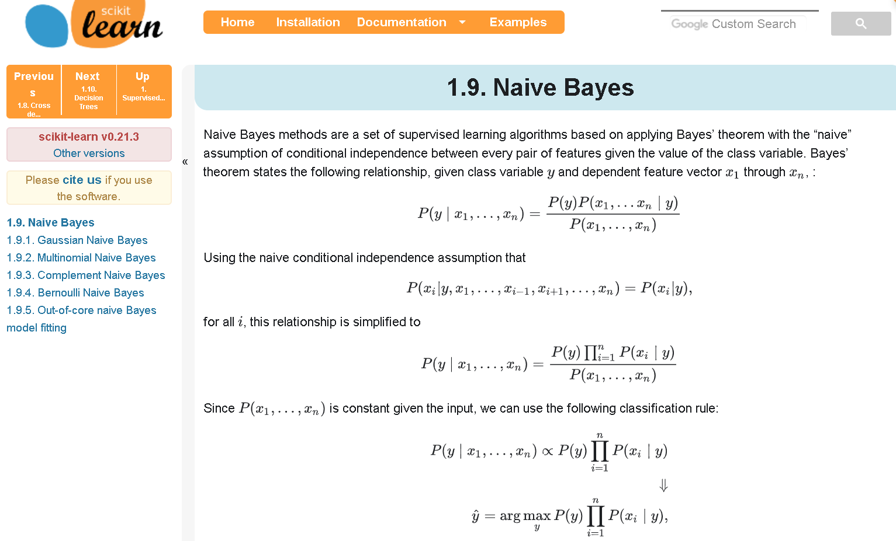
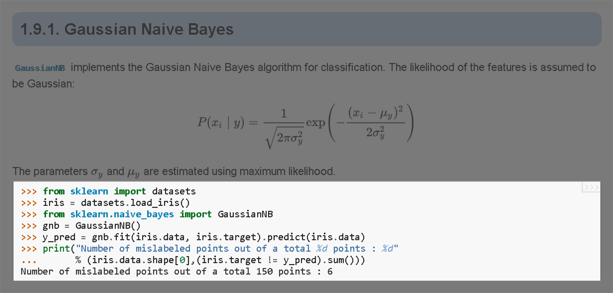

## Ethical AI

With the world's data becoming more available and connected (turning into a 'global brain') AI engineers like yourself will have to start wondering about the ethical aspects too. For example, as AI is about automating the decision-making process, there is a risk that your application is biased and inadvertently discriminate some people. To prove this point, I ellaborate on a few examples:

- A Google image recognition program labelled the faces of several black people as gorillas ([The Guardian](https://www.theguardian.com/technology/2015/jul/01/google-sorry-racist-auto-tag-photo-app))
  
- A LinkedIn advertising program showed a preference for male names in searches ([The Seattle Times](https://www.seattletimes.com/business/microsoft/how-linkedins-search-engine-may-reflect-a-bias/))
  
- The Microsoft chatbot 'Tay' spent a day learning from Twitter and began spouting antisemitic messages ([The Guardian](https://www.theguardian.com/technology/2016/mar/24/tay-microsofts-ai-chatbot-gets-a-crash-course-in-racism-from-twitter))
  


If you think ethical aspects do not apply to you, think again. Wherever you will be using AI, the question of ethics will *always* be on the table. Indeed, with great power comes&hellip;

On the 8<sup>th</sup> of April 2019, the European Union published a [set of guidelines](https://ec.europa.eu/digital-single-market/en/news/ethics-guidelines-trustworthy-ai) on ethical AI. Before continuing, you are advised to read the [short story](https://www.theverge.com/2019/4/8/18300149/eu-artificial-intelligence-ai-ethical-guidelines-recommendations) and remember especially the following principles:

> A human must be able to intervene or oversee every decision taken by the AI application

> The AI application must be secured from external attacks or manipulation (example VircoType)

> The AI application must be accurate, always (as accuracy may evolve over time)

> Operators must be able to explain the decisions made by the AI application

> The AI application, when applicable, must not be biased towards age, gender or race of the predefined group of target users

> Personal data gathered by the AI application must follow the Global Data Protection Regulation (GDPR) (consent, transparency, security and the right to be forgotten)

## Getting Started

Enough said, let's get started. If you want to be able to follow all steps in this course, make sure you follow these steps:

- Install [Visual Studio Code](https://code.visualstudio.com/download)
- (TODO: Version) Install [Python](https://www.python.org/downloads/) `3.7.4` (make sure you can execute `> python` directly from the command prompt)
- Install `Python Extension Pack` and read [these](https://code.visualstudio.com/docs/languages/python) guidelines
- Install [pip](https://www.liquidweb.com/kb/install-pip-windows/)
- Install [Jupyter Notebooks](https://jupyter.org/install)
- Install the VS Code extensions `Jupyter` and read [these](https://code.visualstudio.com/docs/python/jupyter-support) guidelines

Furthermore, git was assumed to be correctly installed on your system and it is assumed you have arrived at this file by cloning (TODO: Path) [this]() repository.

## The Gaussian Naive Bayes Classifier

### The Goal

Suppose we are testing a self-driving car in the desert. An important aspect of the car is to know when to go fast and when to go slow. Suppose we have some idea that the speed should mainly be controlled by the steepness and bumpiness of the terrain. Both these variables have been coded as decimal numbers in the range [0, 1]. Human drivers have driven around in the desert so as to train the car. The goal for the car is to predict whether to drive fast or slow (whatever that means exactly) based on any given combination of the steepness and bumpiness.

### The Program

If the installation went well, you should be able to open the file `Naive_Bayes.py`:

```python
# External libs
from sklearn.naive_bayes import GaussianNB
from sklearn.metrics import accuracy_score

# Own libs
from Data import Terrain_Data
from Visuals import Plot

# Collect the data
Features_Trn, Outcomes_Trn, Features_Tst, Outcomes_Tst = Terrain_Data ()

# Instantiate learner and train it
Learner = GaussianNB ()
Learner.fit ( Features_Trn, Outcomes_Trn )

# Plot the decision boundary with test data overlaid
Plot ( Learner, Features_Tst, Outcomes_Tst )

# Make predictions on test data and calculate performance
Outcomes_Prd = Learner.predict ( Features_Tst )
Performance = accuracy_score ( Outcomes_Prd, Outcomes_Tst )

print ( Performance )
```

We will now examine this program in more detail below. For now, run the code and you should find the following image called `Live.png` that was generated in the `OUTPUT` folder:


In addition, the number `0.884` should have been printed to the console.

So, what are we looking at? The points in the scatter plot each represent a combination of a particular value of steepiness and bumpiness. The red and blue areas represent the possible combinations where the car is to drive slow and fast, respectively. On a bumpy steepy terrain, the car should drive slow, while on a horizontal and flat terrain, the car is allowed to pick up some speed.

### Importing Scikit Learn

There are several Python libraries available for running ML algorithms (`TensorFlow`, `Keras`, `PyTorch`, &hellip;), but `sklearn` (scikit learn) seemed appropriate to learn the first steps of ML and will be the main library used in this course:

```python
from sklearn.naive_bayes import GaussianNB
```

The first line imports the class `GaussianNB` a particular type of algorithm called the *Gaussian Naive Bayes* algorithm. We will learn a bit more about the inner workings of this algorithm, but for now all you need to know is that this algorithm is one of many. How do you know which module to import? Well, if you are told to train a Gaussian Naive Bayes learner (learner is another word for a ML algorithm) from the Scikit Learn library, you simply Google it:


The first link in the above screenshot brings you to the actual class for the Gaussian Naive Bayes, while the second one brings you to the set of classes all belonging to the Naive Bayes group. If you follow the second link, as will generally be the case on syou'll find some theoretical considerations:



Don't be put off by the mathematical equations. As promised, this course will be low on mathematics, so you can safely skip that part and scroll down to the example code for the `GaussianNB` class:



Scikit learn will always have some example code and copying from it will be the most efficient to get started on a new algorithm.

### Importing Data for Supervised Learning

In this first example, data is being prepared for you. Later we will learn how to collect and prepare data for analysis.

```python
from Data import Terrain_Data

[…]

Features_Trn, Outcomes_Trn, Features_Tst, Outcomes_Tst = Terrain_Data ()
```

The last line in the above snippet loads the terrain data from a local module (`Data.py`) and distributes its constituent parts to 4 seperate variables where `Features_·` stands for *features* (also called *inputs*, *attributes*, *variables* or *fields*), `Outcomes_·` for the outcomes (also called *labels*, *outputs*, *classes*, *targets* or *answers*), `·_Tst` for testing and `·_Trn` for training.

> When we are dealing with supervised ML, we will always have training features, training outcomes, test features and test outcomes

### Training the Learner

The next step is to provide the learner with the *training set*, consisting of the training features and the training outcomes:

```python
Learner = GaussianNB ()
Learner.fit ( Features_Trn, Outcomes_Trn )
```

The learner will endeavour to discover patterns in `Features_Trn` that somehow enable the prediction of `Outcomes_Trn`. Note that the term `fit` is a bit of a misnomer which refers to classical modelling. The result of the learning operation, however, is still a *model* similar to the regression line in simple regression analysis. This model can be copied around and investigated separately, although in our sklearn example, it resides within the `Learner` variable until we actively extract it.


> Training a learner results in a model

As you might imagine, the step of training the learner, is the most crucial step in the entire process of developing a supervised learning algorithm. This is the step where the actual pattern recognition takes place. As a AI engineer, you will spend quit some time on this part of the process.

### Prediction

We skip the plotting of the results to a later point an focus now on the prediction of outcomes based on a set of new data called the *test set*. The following line of code:

```python
Labels_Prd = Learner.predict ( Feates_Tst )
```

performs the *prediction*. Let us expand the process flow for unsupervised learning:


While this step is a very simple one and while it is not unique to the field of AI, it is the one the generates the most awe. If the training was done properly and if the data contains some patterns to begin with, the prediction step allows the data scientist to literally *see into the future*. A feat that mankind has pursued for thousands of years&hellip;


### Accuracy

Developing an AI application without doing a proper diagnosis is silly. Why? Because in real life you generally cannot predict the future. You can *try* to predict the future and you can get very good at it, but remember:

> In most cases one cannot predict future events with 100% certainty

Let us revisit the code for doing diagnostics from our example:

```python
from sklearn.metrics import accuracy_score

[…]

Performance = accuracy_score ( Outcomes_Prd, Outcomes_Tst )
```

which should evaluate to 88.4% in our case. This means that, assuming we did not introduce any bias, the application will correctly estimate the proper speed category of the car in *about 9 out of the 10 cases*.

Notice that for the first time in the process, we include the test outcomes `Outcomes_Tst`. It is a crucial principle that:

> In order to test the performance of an algorithm, the test outcomes should remain hidden for the applocation untill **after** the training phase

### Reporting Results

> TODO: To be completed

## The AI Project

We now take a step back to understand the AI process flow.

### Requisites for a AI Project

## Step 1 — Assemble a Team

## Step 2 — Analyse the Problem Statement

## Step 3 — Separate Features from Outcomes

## Step 4 — Decide on the performance measure

## Step 5 — Define the criteria for being successful

## Step 6 — Collect the Data

### Sources of Data

- From controlled experiments/trials (RCT) versus so-called real-world evidence (RWE)
- Google Trends
- Social Media (e.g. Twitter)
- Github
- https://www.quantopian.com/
- https://www.wunderground.com/weather/api/
- Meta-data: e.g. usage statistics
- https://vincentarelbundock.github.io/Rdatasets/datasets.html
- https://data.fivethirtyeight.com/
- Kaggle
- [UCI Machine Learning Repository] (http://mlr.cs.umass.edu/ml/)
- https://www.quandl.com/search
- https://data.world/
- https://www.reddit.com/r/datasets/
- https://academictorrents.com/browse.php
- https://www.dataquest.io/blog/free-datasets-for-projects/

Example of search path to arrive at data:
- https://www.researchgate.net/publication/324478225_Outlier_Detection_in_Ocean_Wave_Measurements_by_Using_Unsupervised_Data_Mining_Methods
- Outlier_Detection_in_Ocean_Wave_Measurements_by_Us.pdf
- https://www.ndbc.noaa.gov/data/
- Belgische Boei gegeevns

### Ownership and Accountability

- Know where the data comes from
- Know who is accountable for the data
- Contact owners if needed
- Legal issues

### Data Delivery

- Static data set of one or multiple files
- Relational databases and their relations
- Data streams (not limited to video and audio streams)

### The Data Dictionary

The data dictionary is the key to understand the data and understanding the data is key to a proper AI project.

- Units

### Crawlers and Scrapers

### Generate Your Own Data

The above examples are all from external sources, but is wome cases, it makes sense to generate the data yourself through surveys or through scientific experiment.

## Step 7 — Prepare the Data

### Types of Data Analysis

- Descriptive analytics (What happened)
- Diagnostic analytics (Why something happened)
- Predictive analytics (what is likely to happen in the future)
- Prescriptive analytics (what should you do)


[bron](https://towardsdatascience.com/introduction-to-statistics-e9d72d818745)

### Raw Data

- File types, MIME types and encodings (see e.g. https://stackoverflow.com/questions/8527241/python-pickle-fix-r-characters-before-loading)
- Keep track of sources, owners, and license

> Always keep a copy of the raw data

### Exploring the Data

- Visual inspection
- Shape (dimensionality)
v Distribution
- How many instances
- Balance among groups
- Special treatment for space and time
- Analysing the categories
- Discover hidden data (e.g. in Microsoft Excel)

#### Plotting

- The pupose of the visualization (compare, compose, trend, compare)
- Parts of a graph
- Do's and Dont's
- Histogram, boxplot, barchart, scatterplot, linechart, dot-plot
- simple = better
- The correlation matrix
- The density diagram
- The spherical histogram
- Cyclilc data: http://web.cs.wpi.edu/~matt/courses/cs563/talks/Cyclic_Presentation/index.html
- Using colors
- https://nl.wikipedia.org/wiki/Kwartet_van_Anscombe
- Deceptive graphs (see examples online https://www.statisticshowto.datasciencecentral.com/misleading-graphs/)
- Number of variables
- Visualizing spread
- Number of instance per category

### Statistical considerations

- Central Limit Theorem
- Chebyshev's unequality and the law of the large numbers
- Parametric versus non-parametric
- Measures of central tendency and dispersion
- Range, mean, quantiles (median), mode, standard deviation (Excel flaws)
- Correlations
- Causality
- Multi-modality
- Rounding

### The Data Preparation Pipeline

- Setting up a documented pipeline
- Scientific mindset
- The Value of the [IBM method](https://www.ibmbigdatahub.com/blog/why-we-need-methodology-data-science)
- Value chain
- All steps from Raw Data to analysis data set must be reproducible

### Filter

- Access reliability versus relevance
- https://tdwi.org/Articles/2014/05/13/Data-Quality-Relevance-vs-Reliability.aspx?Page=2
- Decide what data to keep and what to drop

### Missing Data

- MCAR, MAR, MNAR
- Imputation

### Re-shaping the Data

- Pivotting
- Aggregation

### Merging Data Sets

Merging multiple data sets by creating unique identifiers.

### Cleaning Data

- Removing special characters
- New-line removal
- Trimming
- Commas and dots
- https://www.ndbc.noaa.gov/data/dart/Apr/2141342019.txt.gz
- Use of regular expressions

### Outliers

- Reflect on causes for extreme values
- Check the raw data
- Document
- Remove, replace, &hellip;

### Generate an Analysis Data Set

- Advantages of tab-delimited text files

### Feature Extraction

- Transformations
  - Log-transform
  - Logit
- Similarity indices

## Step 8 — Deciding on the Algorithms

- Document all assumptions
- Trade-Off Speed/Quality of algorithm (Credit card fraud versus image recognition)

## Step 9 — Training the Learner

### Supervised versus Unsupervised Learning

Definition according to *Tom M. Mitchell*:
"A computer program is said to learn from experience E with respect to some class of tasks T and performance measure P, if its performance at tasks in T, as measured by P, improves with experience E." [source](https://en.wikipedia.org/wiki/Machine_learning)

### Training and Test Set

- Training set, test set and validation set
- https://scikit-learn.org/stable/_images/grid_search_workflow.png and https://scikit-learn.org/stable/modules/cross_validation.html
- Data snooping, see https://web.ma.utexas.edu/users/mks/statmistakes/datasnooping.html
- Data leakage:
	- See for example https://stackoverflow.com/questions/48482440/scikit-learn-avoiding-data-leakage-during-cross-validation
	- Imputation of test data should be based on training data alone
	- see also https://machinelearningmastery.com/data-leakage-machine-learning/
- Cross validation

### Classifiers versus Regressors

### The Art of Paramatrization

- Learn to find documentation on the parametrization and try to understand what they do
- Tuning parameters and cross-validation
- https://scikit-learn.org/stable/_images/grid_search_workflow.png

### Over-Fitting and the Bias-Variance Trade-Off

Bias can be seen as how well de algorithm ignores the data. A biased algorithm has a small capacity to learn anything. So a biased car would, no matter how much we train it, do nothing differently. That is obviously a bad idea in ML. The other extrmee is when the algorithm is extrmely perceptive of the data. As a result, it can only replicate stuff that it has seen before. It has no way to generalize to new stuff (over-fitting). Such an algorithm has an extreme high variance. Also that is not very useful. The truth lies somewhere in the middle. Where exactly is the subject of ML.

- Regression analysis versus AI project
- Goal: OOS prediction = Generalization
- Regularisation

### Decision Trees

- Popularity
- Types
- http://www2.cs.uregina.ca/~dbd/cs831/notes/ml/dtrees/c4.5/c4.5_prob1.html
- Recursive partitioning
- Random forests and gradient boosting
- Axis parallel decision boundaries
- Entropy and Information gain

### Naive Bayes

- Bayes Rule (without formulas)
- Prior, Posterior, Normalizer, Joint probability
- Update

### Support Vector Machines

- https://classroom.udacity.com/courses/ud120/lessons/2252188570/concepts/24444685360923
- https://scikit-learn.org/stable/modules/svm.html
- The kernel trick and dimensionality
- Decision boundary
- Parametrisation of SVM

## Step 10 — Predicting Outcomes

### Time Series and Forecasting

## Step 11 — Comparing Results

### Accuracy and Precision

- Accuracy Precision
- Sensitivity, Specificity

### Diagnosis by way of Simulating

## Step 12 — Decide on Life Cycle

## Step 13 — Report

- Principle of using notebooks

## Step 14 — Publish the Application

## Step 15 — Follow-up

## Further Reading

- https://www.learndatasci.com/free-data-science-books/
- https://artint.info/2e/html/ArtInt2e.html
- https://twitter.com/peeterskris

## Appendix

----------------------------------------------------
# Labs

## Individual Projects

### Installation

#### Assignment

- Installeer Python 3.X op jouw computer
- Installeer Jupyter Notebooks indien je deze nog niet hebt
- Installeer de nodige PLugins voor VS Code
- Definieer een werkfolder `Test` op jouw PC en open deze met VS Code
- Maak een nieuw python bestand aan met de naam `Test.py`
- Voer hierin de onderstaande code uit met twee Jupyter Notebook cellen:

	```python
	#%%
	msg = "Hello World"
	print(msg)
	#%%
	%%time
	import matplotlib.pyplot as plt
	p=np.linspace(0, 20, 100)
	plt.plot ( p, np.sin(p
	))
	```

- Als alles goed gaat, krijg je zoiets te zien (The first run might take a minute or so to start Jupyter Notebooks in the background):

	

#### Given

- De [website van VS Code waarin de installatie van beschreven staat](https://code.visualstudio.com/docs/python/jupyter-support)
- [Jupyter Guide](Jupyter_Guide.md)
  
### Python

- data types, expressions, variables, lists, sequences
- (multi)assignments, sequence slicing, list operations, list comprehension.
- Pandas and NumPy libraries
- (multi-dimensional) array operations
- Dataframe, Index and Series objects
- Sort, filter, pivot, reshape, merge and manipulate datasets
- Jupyter
- Markdown cells

### Naive Bayes Exercise

  - Test the effect of the amount of available data
  - 'Playing around' with parameters
  - Plotting

### NLP exercise

  - Predicting ownership of book (https://languagelog.ldc.upenn.edu/nll/?p=5315)
  - Corpus manipulations with JGAAP program (handles issues like normalizing whitespace and stripping punctuation in a straightforward manner)
  - Distribution of word lengths
  - Character n-grams
  - Distance measure: normalized cosine distance

### Current Events

#### Assignment

- Bespreek kort twee nieuwsartikels die handelen over artificiële intelligentie
- Bespreek de mate waarin het betrokken bedrijf data-driven is
- Beschrijf de taak van de learner
- Zeg iets over het type machine learning dat hier gebruikt werd
- Zeg iets over hoe er gecontroleerd werd (en zou moeten worden) of de learner goed werkt
- Beschrijf de conclusies die worden getrokken

#### Given

- Eén artikel willekeurig gekozen uit een lijst van nieuwsartikels (bijv. van de VRT NWS site)
- Eén zelf uit te zoeken artikel binnen persoonlijke interessesfeer
- Sjabloon met voorbeeld
	Soort ML	Beschrijf de ML taak	Training data beschikbaar? Geef de link	Wat zijn de belangrijkste resultaten / conclusies?	Zijn er tekortkomingen of uitdagingen voor de toekomst?	Jaartal	Bron(nen)
	
	Classification task, Supervised, instance based, batch learning: kNN Based Association	Determine wine quality based on 11 physical chemical data measurements	yes:
	4898 instances, 12 attributes	The optimal k value for the dataset is39 (red wine) and 89 (white wine).
	Feature selection is calculated on group support: if an attribute has a wide variety of values, then these attributes will have a small group support value	The accuracy does not exceed 72%, a different algorithm may yield more accurate results.	2011	Indonesian paper src
- THEOR_ rond het data-driven zijn van organisaties
- THEOR_ rond de types van ML
- [Dit e-book](Wiley.Big.Data.in.Practice.pdf)

#### The Course of the Assignment

- Deze opdracht wordt éénmaal aan het begin en eenmaal aan het einde van het lessenpakket gegeven

#### Learning Objectives

- Aanleren wat de waarde is van nieuwsitems rond artifiële intelligentie
- Het koppelen van de technische mogelijkheden van ML met reële maatschappelijke vraagstelling

### Feedback to Lector

- In kaart brengen van de evolutie van de kennis rond artificiële intelligentie bij de student

## Group Project

### Assignment

- Choose Topic
- Ga op zoek naar een interessante databron naar keuze
- Bedenk zelf een interessante vraagstelling over deze data
- Koppel de vraagstelling met een nuttig en haalbaar data-analyse project
- Request approval for project
- Execute
- Report

### Given

- Template with example project

### Course

- Groepjes van 3-5 studenten treden in competitie met elkaar voor het uitwerken van een gemeenschappelijke casusopdracht
